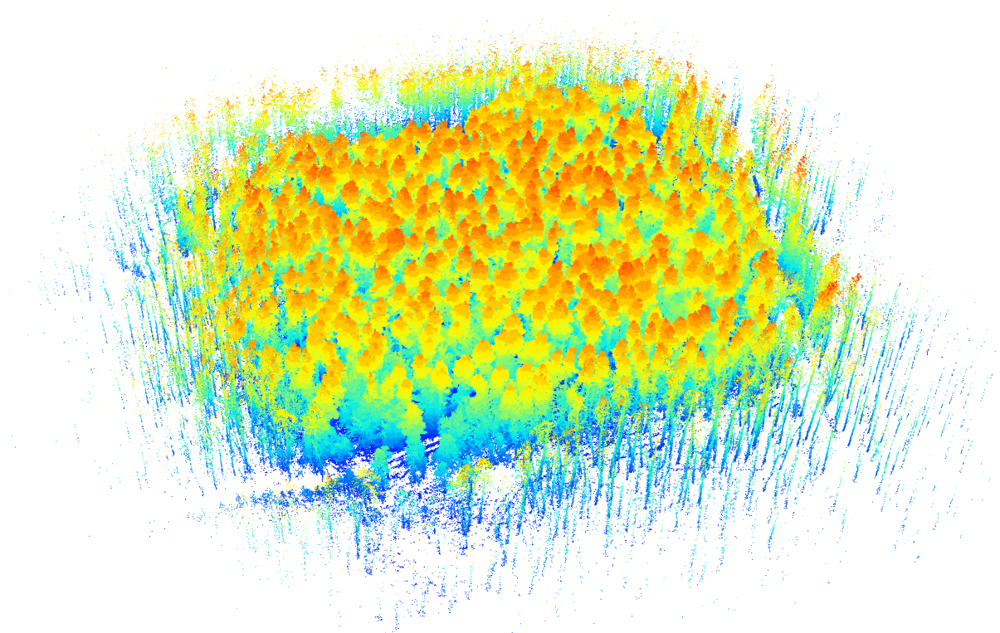
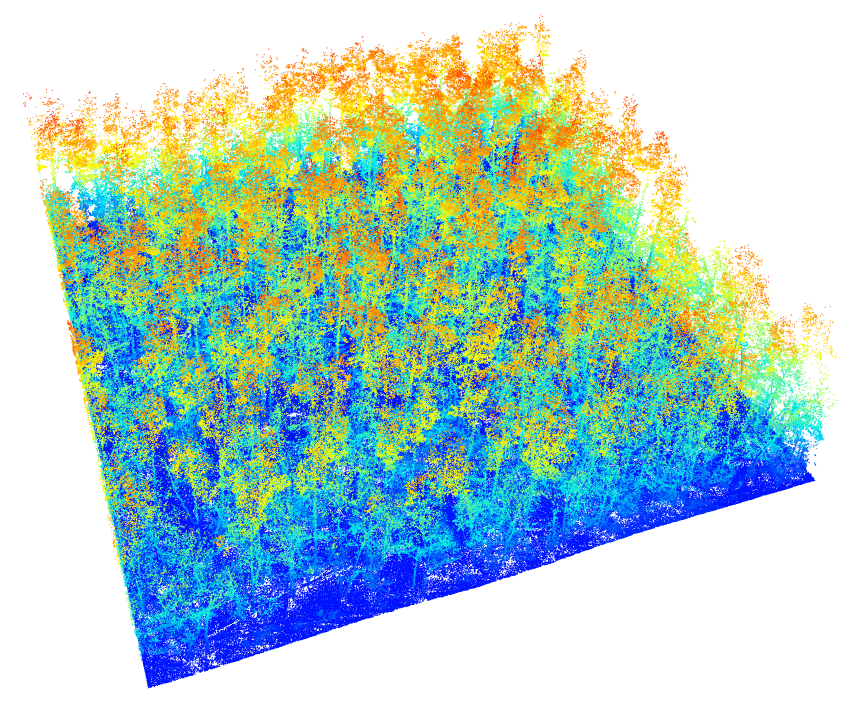
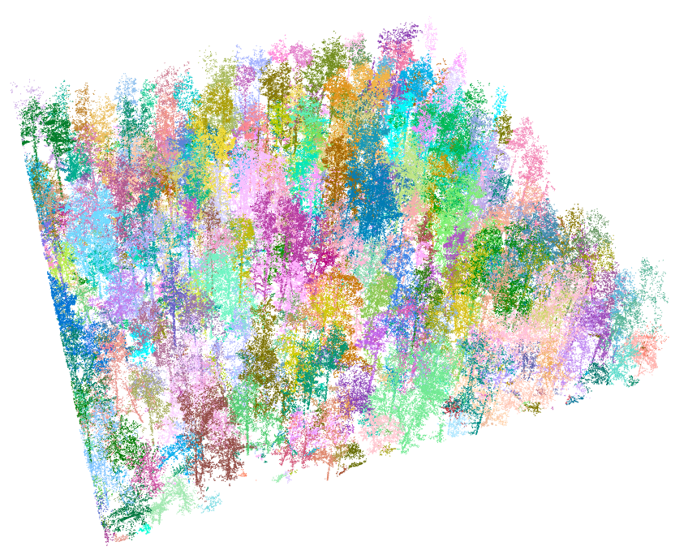

# LiDAR-individual-tree-attribute
Materials for the course of virtual forest twins based on marteloscope point cloud data in [__VirtualForest project__](https://virtualforests.eu/)

The tutorial provides guidance on estimating individual tree attributes based on marteloscope point cloud data. The acquisition of basic tree attributes, including tree height, DBH, and crown area, contributes to the development of virtual forest twins. The tutorial includes 05 lectures along with R scripts: 

## 1. Setup working environment
This section aims to give a short introduction to the R programming language and Rstudio application as an integrated development environment for R. A step-by-step guide to setup R and Rstudio was also given, the environment that will be further used for LiDAR point cloud processing.

> Users are recommended to use R version 4.2.2, and reproduce R environment using the renv.lock file. For more information, please find [Introduction to renv](https://rstudio.github.io/renv/articles/renv.html)

## 2. Introduction to LiDAR fundamentals  
LiDAR or **Li**ght **D**etection **a**nd **R**anging is an active remote sensing technology that can be used to measure 3-dimensional distribution of vegetation within forest canopies. The section introduce fundamental of LiDAR (or lidar) including:

1. What is LiDAR?
2. Advantages of LiDAR
3. Disadvantages of LiDAR
4. LiDAR components
5. LiDAR Principle
6. LiDAR Platforms
7. Data structure
8. Important definitions
9. LiDAR metrics
10. Software for LiDAR processing

## 3. LiDAR data pre-processing
The section provide guidance to preprocess the raw point cloud data, including:

1. Point cloud clipping to area of interest
2. Point cloud thinning for homogeneous density
3. Point cloud filtering to remove noises or outliers
4. Terain normalization

## 4. Individual tree segmentation
For extracting tree attributes at a single tree scale, a segmentation of tree crowns is required. The Individual Tree Segmentation (ITS) classifies LiDAR point clouds into single trees with corresponding IDs. After segmentation, each point has an ID corresponding to the tree it belongs to. In this section, raster-based and point cloud-based segmentation algorithms were introduced.

## 5. Tree attribute estimation
After individual tree segmentation, tree attributes at single tree level can be calculated. In this section, methods to estimate some basic tree inventory attributes were introduced:

1. Crown area as area 2D convex hull polygons
2. Tree height derived from the highest point in each segmented tree
3. Tree location as barycenter of all points in each segmented tree
4. DBH estimate using allometry

